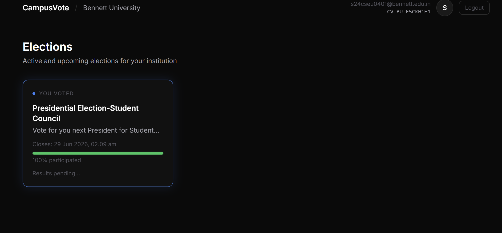

# CampusVote 🗳️

A secure, full-stack online voting platform built for Indian college students. Each institution gets its own isolated voting environment with OTP-verified student accounts, admin-controlled elections, and tamper-proof vote recording.

---
## Screenshots

### Landing Page


### Student Login


### Dashboard


### Admin Login


### Admin View


### Live Stats

## Features

- **Multi-institution support** — 20+ Indian colleges preloaded, each with verified email suffix validation
- **OTP-based signup** — students verify via college email before creating an account
- **Unique Voting ID** — every student gets a `CV-XXX-XXXXXXXX` ID as their voting receipt
- **Bento grid dashboard** — live, voted, upcoming, and results cards in a clean dark UI
- **One vote per event** — enforced at both API and database level
- **Admin portal** — create elections, add candidates with photos, control result publishing
- **Role-based access** — SuperAdmin manages all institutions; college admins manage their own
- **Rate limiting & JWT auth** — secure by default with refresh token rotation

---

## Tech Stack

| Layer | Tech |
|---|---|
| Frontend | React (Vite), TailwindCSS, Framer Motion |
| Backend | Node.js, Express.js |
| Database | PostgreSQL (Prisma ORM) |
| Cache / OTP | Redis (Upstash) |
| Auth | JWT (access + refresh), bcrypt |
| Email | Nodemailer / SMTP |
| File Upload | Multer |

---

## Getting Started

### Prerequisites
- Node.js v18+
- PostgreSQL database (local or [Neon.tech](https://neon.tech))
- Redis instance (local or [Upstash](https://upstash.com))

### 1. Clone the repo
```bash
git clone https://github.com/Sarbojit777/campusvote.git
cd campusvote/campusvote
```

### 2. Setup backend
```bash
cd backend
cp .env.example .env
# Fill in your credentials in .env
npm install
npx prisma db push
npm run db:seed
npm run dev
```

### 3. Setup frontend
```bash
cd ../frontend
npm install
npm run dev
```

Frontend runs on `http://localhost:5173` — Backend on `http://localhost:5000`

---

## Environment Variables

```env
DATABASE_URL=          # PostgreSQL connection string
REDIS_URL=             # Redis connection string (use rediss:// for TLS)
JWT_ACCESS_SECRET=     # Random string, min 32 chars
JWT_REFRESH_SECRET=    # Random string, min 32 chars
JWT_TEMP_SECRET=       # Random string, min 32 chars
SMTP_HOST=             # smtp.gmail.com
SMTP_PORT=             # 587
SMTP_USER=             # your Gmail
SMTP_PASS=             # Gmail App Password
```

---

## Default Admin Account

After seeding, a SuperAdmin account is created:

```
Email:    superadmin@campusvote.in
Password: SuperAdmin@123
```

---

## Pages

| Page | Route | Description |
|---|---|---|
| Landing | `/` | Institution selector |
| Login | `/login` | Student login with email suffix check |
| Signup | `/signup` | 3-step: email → OTP → password |
| Dashboard | `/dashboard` | Bento grid of all voting events |
| Vote | `/dashboard/events/:id` | Candidate cards + vote confirmation |
| Admin Login | `/admin/login` | Admin portal entry |
| Admin Dashboard | `/admin` | Manage events, candidates, results |

---

## Project Structure

```
campusvote/
├── backend/
│   ├── prisma/         # Schema + seed
│   └── src/
│       ├── controllers/
│       ├── routes/
│       ├── middleware/
│       └── services/
└── frontend/
    └── src/
        ├── pages/
        ├── components/
        ├── context/
        └── hooks/
```

---

